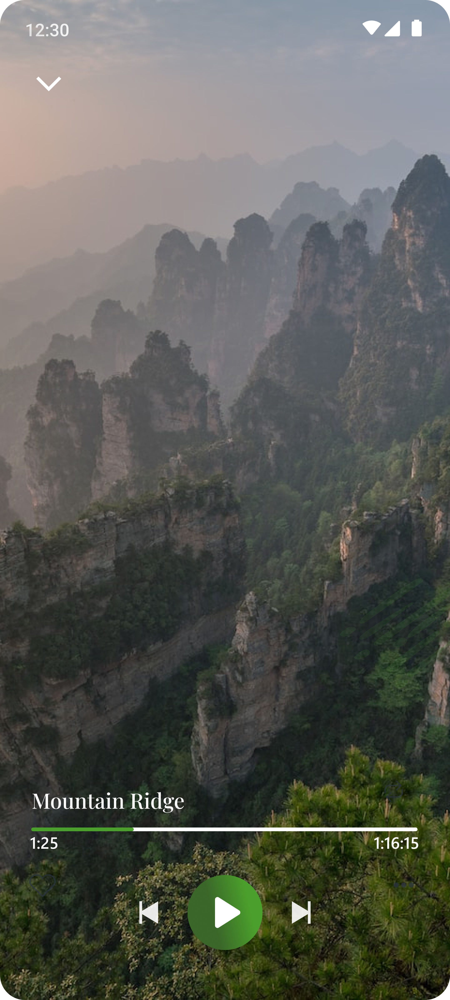

# ABOUT 


<b>Serenitte</b> is an app designed to help users manage their mental health and wellness through personalized tools, resources, and support from skilled health personnels. The app offers features such as mood tracking, guided meditations, self-help resources, virtual therapy, and community support. With mood tracking, users can log their moods and identify patterns and triggers that affect their mental well-being. Guided meditations and mindfulness exercises are available in different lengths and styles to suit individual needs. The self-help resources library covers topics such as anxiety, depression, stress, self-esteem, and relationships. Virtual therapy sessions with licensed mental health professionals can also be accessed through the app. Users can also connect with a supportive community of others who are managing their mental health. Serenitee
 aims to help users take control of their mental health and live a happy and healthy life.


# FEATURES

- [ ] Mood tracking: Serenitee
 allows you to track your mood and emotions, helping you to identify patterns and triggers. You can log your mood each day and track it over time, enabling you to understand how your mood fluctuates and how different factors affect your mental well-being.

- [ ] Guided meditations: Serenitee
 provides a range of guided meditations and mindfulness exercises to help you reduce stress, anxiety, and depression. You can choose from different lengths and styles of meditation to suit your needs and preferences.

- [ ] Self-help resources: Serenitee
 provides a library of self-help resources on mental health, including articles, videos, and audio guides. These resources cover a range of topics, such as anxiety, depression, stress, self-esteem, and relationships.

- [ ] Virtual therapy: Serenitee
 provides access to virtual therapy sessions with licensed mental health professionals. You can choose from different therapists and book sessions at your convenience.

- [ ] Community support: Serenitee
 allows you to connect with a supportive community of users who are also managing their mental health. You can share your experiences, offer support, and get advice from others who understand what you're going through.

# ANALYTICS
To enable Serenitee to make informed decisions on how to make changes to the usability and dynamic needs of it's users, we would be using a centralized Dashboard and Analytics Web System to track the progress and statistics of every registered user and take into accountabilty of each one.
Link to Serenitee Dashboard : <a href="https://github.com/ingucell/Serenitee-Admin">Serenitee Admin Dashboard</a>

# TO VIEW OUR INFORMATION ARCHIETECTURE AND DESIGN FLOW DIAGRAMS
Link to Figma Designs For Serenitee App : <a href="https://www.figma.com/file/yUX5drCowH1W7yyq7buyJ5/mental-health-duplicate?node-id=0%3A1&t=Hldr0rMDXlHEwRGv-1">Serenitee Design Diagrams</a>


# TO VIEW OS DESIGN FLOW & UI DESIGN FOR SMART WATCH
Link to Figma Designs For Serenitee Smartch Watch App : <a href="https://www.figma.com/file/YY6zweDYbvU8AYeilC6slr/smart-watch-feature?node-id=0-1&t=IK2nTWg6Zkt8mWVz-0">Serenitee Smart Watch UI</a>
<p align = "center">


</p>


# TECH STACK (MOBILE)
- [x] Flutter - UI
- [x] Firebase - backend
- [ ] GCP - Cloud Storage 
- [ ] Tensor flow - ML

# LINK TO PROTOTYPE (FULLY BUILT FOR UI TESTINGI)
- Link to repository: <a href="https://github.com/SalamiTech/serenitte-prototype">Serenitee Prototype Mobile App</a>


# HOW TO INSTALL & RUN APP (TERMINAL)

```Clone the repository```

```Run pub get```

```Run flutter```


# ONBOARDING SCREENS / SPLASH SCREENS
<p align = "center">


</p>

# HOME & CALENDAR SCREENS
<p align = "center">


</p>

# MUSIC & PODCASTS
<p align = "center">


</p>

# SLEEP & STORIES
<p align = "center">


</p>

# VIRTUAL THERAPY & APPOINTMENTS
<p align = "center">


</p>

# VIRTUAL THERAPY & APPOINTMENTS
<p align = "center">

</p>


